# 1. JavaScript概述

Javascript是基于对象和事件驱动的脚本语言，主要应用在客户端

- 基于对象：提供好了很多对象，可以直接拿过来使用
- 事件驱动：html做网站静态效果，javascript动态效果
- 客户端：专门指的是浏览器

JavaScript的特点：

- 交互性：信息的动态交互
- 安全性：不可以直接访问本地硬盘
- 跨平台性：只要是可以解析js的浏览器都可以执行，和平台无关

javascript和java的区别（雷锋和雷峰塔）

- java是sun公司，现在oracle；js是网景公司
- JavaScript 是基于对象的，java是面向对象
- java是强类型的语言，js是弱类型的语言
- 比如java里面 int i = "10";
- js:  var i = 10; var m = "10";
- JavaScript只需解析就可以执行，而java需要先编译成字节码文件，再执行

# 2. JavaScript与java不同

- Netscape公司开发的一种脚本语言 ，并且可在所有主要的浏览器中运行 ：IE、Firefox、Chorme、Opera
- JavaScript 是基于对象的，java是面向对象
- JavaScript只需解析就可以执行，而java需要先编译成字节码文件，再执行
- JavaScript 是一种弱类型语言，java是强类型语言

ECMA-262 是正式的 JavaScript 标准。这个标准基于 JavaScript (Netscape) 和 JScript (Microsoft)。

Netscape (Navigator 2.0) 的 Brendan Eich 发明了这门语言，从 1996 年开始，已经出现在所有的 Netscape 和 Microsoft 浏览器中。

ECMA-262 的开发始于 1996 年，在 1997 年 7 月，ECMA 会员大会采纳了它的首个版本。

在 1998 年，该标准成为了国际 ISO 标准 (ISO/IEC 16262)。这个标准仍然处于发展之中。

# 3. JavaScript历史

- 在早期浏览器竞争的背景下，各浏览器厂商标新立异，独树一帜，JavaScript 脚本编写者们苦不堪言

- W3C、ECMA 的不懈努力下，随着Microsoft 的 IE浏览器的不断改进，一个遵奉标准、笃行规范的 Web 新世界展现在世人面前


# 4. JavaScript语言组成

一个完整 JavaScript实现由以下3个部分组成

- 核心（ECMAScript），ECMA：欧洲计算机协会，由ECMA组织制定的js的语法，语句..
- 文档对象模型（DOM：Document Object Model）
- 浏览器对象模型（BOM：Broswer Object Model）

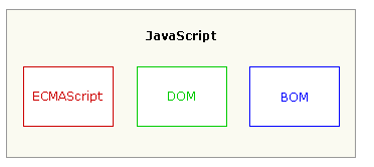

# 5. js和html的结合方式

第一种：使用一个标签
```javascript
<script type="text/javascript"> js代码; </script>
```
第二种：使用script标签，引入一个外部的js文件

创建一个js文件，写js代码

```javascript
<script type="text/javascript" src="1.js"></script>
```
使用第二种方式时候，就不要在script标签里面写js代码了，不会执行。

# 6. JavaScript的基础

## 6.1 JavaScript的变量

JavaScript是弱变量类型的语言。弱变量类型：定义变量的时候变量没有具体的类型，当变量被赋值的时候变量才会有具体的数据类型

```javascript
// 定义变量  在JavaScript中定义所有的变量都使用var.
var a = 1;
var b = "abc";
var c = true;
var d = 'bcd';

// 如果了解变量的具体类型  那么可以使用 typeof
alert(typeof(a));   //  output number
alert(typeof(b));   //  output string
alert(typeof(c));   //  output boolean
alert(typeof(d));   //  output string

// 在JavaScript中 定义字符串  可以使用单引号 或者 双引号
```
## 6.2 JavaScript的数据类型

### 6.2.1 JavaScript和Java一样存在两种数据类型

- 原始值 （存储在栈Stack中简单数据）
- 引用值 （存储在堆heap中对象）

### 6.2.2 5种原始数据类型

- Undefined、Null、Boolean、Number 和 String
- JavaScript中字符串是原始数据类型

### 6.2.3 通过typeof运算符，查看变量类型

所有引用类型都是object

### 6.2.4 通过instanceof 运算符解决typeof对象类型判断问题

在使用 typeof 运算符时采用引用类型存储值会出现一个问题，无论引用的是什么类型的对象，它都返回 "object"。ECMAScript 引入了另一个 Java 运算符 instanceof 来解决这个问题。instanceof 运算符与 typeof 运算符相似，用于识别正在处理的对象的类型。与 typeof 方法不同的是，instanceof 方法要求开发者明确地确认对象为某特定类型。例如：

```javascript
var oStringObject = new String("hello world");
alert(oStringObject instanceof String);	//输出 "true"

```

### 6.2.5 区分 undefined 和 null

- undefined：变量定义了未初始化或访问对象不存在属性
- null：表示访问的对象不存在

```javascript
//var div1 = document.getElementById("div1111");
//alert(div1);  // null

var a;
if(a == undefined){
   alert("a没有初始化");
}

//var div1 = document.getElementById("div1")
//alert(div1.href);
```
## 6.3 JavaScript的语句

### 条件语句

两种：if语句  和 switch语句

if语句:

```javascript
var i = 6;

if(i>5){
        alert("i>5");
}else{
        alert("i<=5");
}
```
switch语句
```javascript
 var a = "2";
// Java中switch作用在什么上?
// 在Java中 switch()  可以 byte short char int  不可以 long  String类型也是不可以 但是在JDK1.7中String类型可以作用在switch上.
// 在JavaScript中 switch是否可以作用在string上. string在JavaScript中是原始数据类型.
switch(a){
      case "1":
            alert("a==1");
            break;
      case "2":
            alert("a==2");
            break;
      case "3":
            alert("a==3");
            break;
      default:
            alert("a是其他值");
}
```
if语句比较的时候 全等和非全等(===   !==)
```javascript
var a = "98";
// 与Java不一样的地方.  == 比较的值. 而且可以进行简单的类型转换.
// 在JavaScript中有一个 === 全等. (值相等 而且 类型也要相等.)
if(a === 98){
        alert("a等于98");
}else{
        alert("a不等于98");
}
```
### 循环语句

for语句
```javascript
var arr = [11,22,33,44];

/*
for(var i = 0;i<arr.length;i++){
        alert(arr[i]);
}
*/
```
while语句
```javascript
var i = 0;
while(i<arr.length){
   alert(arr[i]);
   i++;
}
```
dowhile
```javascript
var i = 0;
do{
  alert(arr[i]);
  i++;
}while(i<arr.length);
```
for in
```javascript
for(var i in arr){
	alert(arr[i]);
}
```
## 6.4 JavaScript中的数组
```javascript
// 定义数组.
var arr1 = [];   // 定义一个空数组
var arr2 = [11,22,33,44];  // 定义了一个有元素的数组.
var arr3 = [11,true,'abc']; // 定义一个数组 存入不同的数据类型. 但是一般不建议这样使用.

/*
for(var i = 0;i<arr3.length;i++){
                alert(arr3[i]);
}
*/
// 定义数组 使用对象定义
var arr4 = new Array();         // 定义了一个空数组.
var arr5 = new Array(5);        // 定义了一个长度为5的数组.
//alert(arr5[0]);
// alert(arr4.length);
var arr6 = new Array(1,2,3,4,5,6);  // 定义了一个数组  元素 1,2,3,4,5
arr6[100] = 10;

// 数组的长度是以 数组的最大下标值 + 1
alert(arr6.length);

// 面试题
/*
        一下的语句那个是错误的(  C  )
        A.var a = //;
        B.var a = [];
        C.var a = ();
        D.var a = {};
*/
```
## 6.5 JavaScript的函数

### 定义函数:

普通方式

```javascript
function 函数名(参数列表){
	// 函数体
}
```

构造方式(动态函数)

```javascript
var 函数名 = new Function(“参数列表”,”函数体”);
```
直接方式

```javascript
var 函数名 = function(参数列表){
	// 函数体
}
```

### 函数中变量作用范围

在JavaScript中存在于两个域的，全局域和函数域

### 特殊的函数

| 函数      | 说明                                 |
| :------ | :--------------------------------- |
| 回调函数    | 作为参数传递的函数                          |
| 匿名函数    | 没有函数名的函数                           |
| 匿名回调函数  | 这个方法作为参数传递而且还没有方法名                 |
| 私有函数    | 定义在函数内部的函数，保证函数的内部代码私有性。一个函数执行多个逻辑 |
| 返回函数的函数 |                                    |
| 自调函数    | 定义()()，第一个小括号是函数定义，第二个小括号是函数调用     |

## 6.6 JavaScript的内置对象

### Array

Array对象属性


Array对象方法

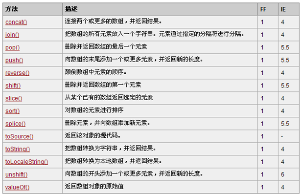

### Boolean

boolean对象属性


boolean对象方法


### Date

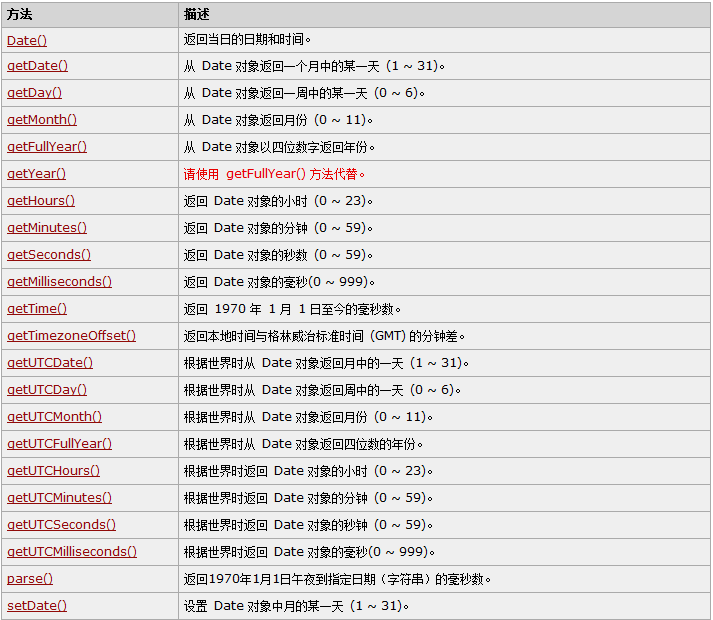


### Math

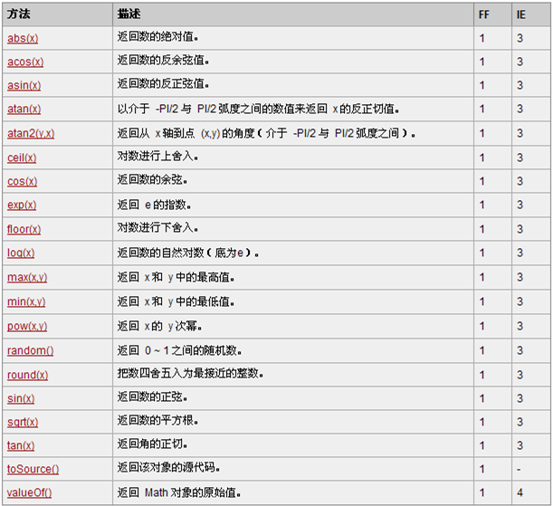

### String

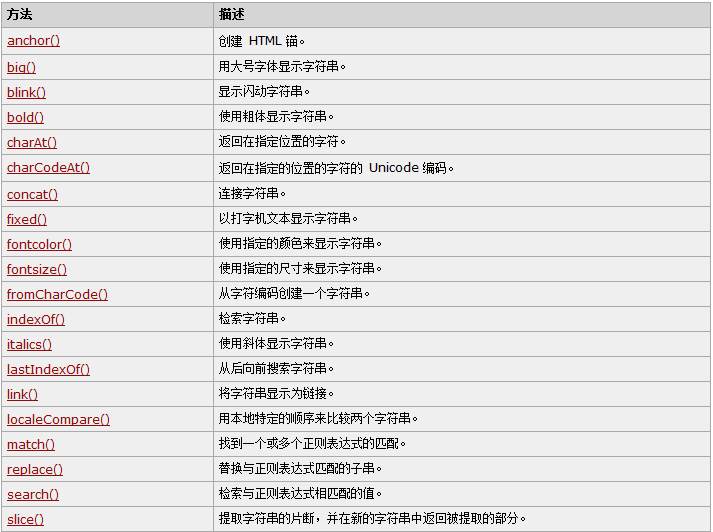

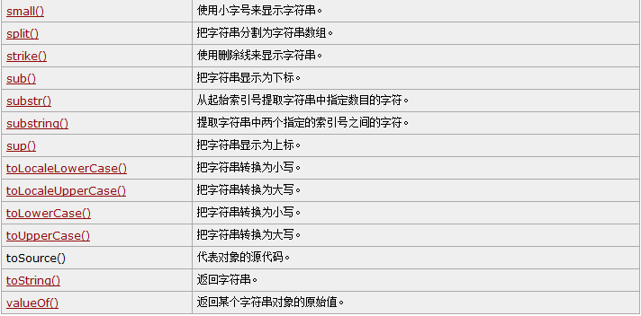

### Number

Number对象属性

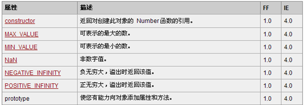

Number对象方法


### js的全局函数

由于不属于任何一个对象，直接写名称使用

| 函数                   | 功能描述                          |
| :------------------- | :---------------------------- |
| eval()               | 执行js代码（如果字符串是一个js代码，使用方法直接执行） |
| encodeURI()          | 对字符进行编码                       |
| decodeURI()          | 对字符进行解码                       |
| encodeURIComponent() | 把字符串编码为URI组件                  |
| decodeURIComponent() | 解码一个URI组件                     |
| isNaN()              | 判断当前字符串是否是数字                  |
| parseInt()           | 类型转换                          |

# 7. JS的面向对象

JS不是面向对象的 是基于对象. JS中的函数就是对象.

## 对象的定义：

一种

```javascript
var p1 = new Object();
```

二种

```javascript
var p2 = {};
```

三种

```javascript
function P{
}
```

## 将三种定义形式，分成两类

普通形式

```javascript
var obj = {
      name:”张三”,
      sayHello:function(){
      }
}
```

函数形式

```javascript
function Person(){
	this.name = “李四”;
	this.sayHello = function(){
	}
}
```
调用的时候  需要new    var p = new Person();

# 8. JS函数中的重载问题

函数的重载：一个类中的方法名相同，但是参数个数或参数类型不同

JS中本身没有重载需要使用arguments对象来实现类似与重载的效果 arguments本身就是数组

```javascript
arguments存的方法中的参数
// 使用argument模拟重载效果.
function add(){
  if(arguments.length == 2){
    return arguments[0] + arguments[1];
  }else if(arguments.length == 3){
    return arguments[0] + arguments[1] + arguments[2];
  }
}

alert(add(1,2,3));
```
## JS中的继承:

要了解继承就需要先了解prototype属性.在每个函数对象中都有一个prototype的属性

那么就可以使用prototype对对象进行扩展（包括内建对象）

prototype：原型，作用用类对函数对象进行扩展

## JS扩展内建对象

```javascript
// 扩展Array对象.判断某一个值是否在数组中。
Array.prototype.inArrays = function(val){
    for(var i = 0;i<this.length;i++){
        if(this[i]==val){
          return true
        }
    }
    return false;
}

var arr = ["red","green","blue"];
alert(arr.inArrays("black"));
```

JS中的继承：JS中本身没有继承，实现继承的效果. prototype就是一个函数对象的属性.利用了这个属性的扩展功能(扩展了的属性和方法  就可以当成在自己类定义的时候定义的那个属性和方法)

利用prototype完成继承的效果
```javascript
function A(){
      this.aName = “a”;
}

function B(){
      this.bName = “b”;
}

B.prototype = new A();
```

## 另一种继承 原型继承.

```javascript
function A(){}
A.prototype = {
	aName : "a"
}

function B(){
	this.bName = "b";
}

B.prototype = A.prototype;

var b = new B();
alert(b.bName);
alert(b.aName);
```

# 9. BOM
Browser Object Model(浏览器对象模型)

- Window:对象表示浏览器中打开的窗口 最顶层对象
- Navigator :浏览器对象
- Screen: 屏幕对象
- History:浏览器历史对象
- Location:地址对象

# 10. Window对象
Window 对象是 JavaScript 层级中的顶层对象，Window 对象代表一个浏览器窗口或一个框架

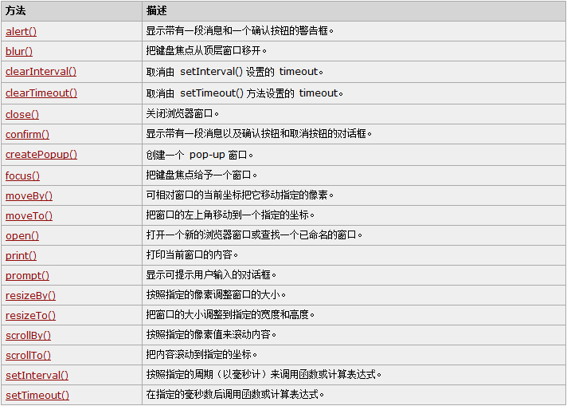

## Window对象常用的方法

| 方法              | 功能描述                             |
| :-------------- | :------------------------------- |
| alert()         | 弹出带有一段消息和一个确认按钮的警告框              |
| confirm()       | 弹出带有一段消息以及确认按钮和取消按钮的对话框          |
| prompt()        | 弹出可提示用户输入的对话框                    |
| setTimeout()    | 定时，执行一次就ok了，在指定的毫秒数后调用函数或计算表达式   |
| setInterval()   | 定时 循环执行，按照指定的周期（以毫秒计）来调用函数或计算表达式 |
| clearTimeout()  | 清除定时                             |
| clearInterval() | 取消由setInterval()设置的timeout       |
| open()          | 打开一个新的浏览器窗口或查找一个已命名的窗口           |
| close()         | 关闭浏览器窗口                          |

案例：open和showModalDialog

## History对象：浏览器的历史对象

History 对象包含用户（在浏览器窗口中）访问过的 URL

| 方法        | 功能描述                   |
| :-------- | :--------------------- |
| back()    | 加载 history 列表中的前一个 URL |
| go()      | 加载 history 列表中的某个具体页面  |
| forward() | 加载 history 列表中的下一个 URL |

## Screen对象:屏幕对象

常用的属性

- width
- height

## Location对象：地址对象

请求url地址，href属性

- 获取到请求的url地址
- 设置url地址

## Navigator对象：浏览器对象

获取客户机的信息（浏览器的信息），navigator.appName

# 11. DOM对象

当网页被加载时，浏览器会创建页面的文档对象模型(Document Object Model)

## 11.1 DOM的介绍

dom：document object model: 文档对象模型

- 文档：标记型文档
- 对象：封装了属性和行为的实例，可以直接被调用。
- 模型：所有的标记型文档都具有一些共性特征的一个体现。
- 用来将标记型文档封装成对象，并将标记型文档中的所有内容（标签、文本、属性）都封装成对象。
- 封装成对象的目的是为了更方便的操作这些文档及其文档中的所有内容。因为对象包含属性和行为。
- 标记型文档包含标签、属性、标签中封装的数据。只要是标记型文档，DOM这种技术都可以对其进行操作。
- 常见的标记型文档包括：HTML   XML。
- DOM要操作标记型文档必须先进行解析。

DOM：将文档解析成内存中的树状结构。通过树状结构对文档进行添加节点删除节点修改节点 查找节点；DOM 是 W3C（万维网联盟）的标准；DOM 定义了访问 HTML 和 XML 文档的标准：

"W3C 文档对象模型 （DOM） 是中立于平台和语言的接口，它允许程序和脚本动态地访问和更新文档的内容、结构和样式。"

## 11.2 DOM结构模型

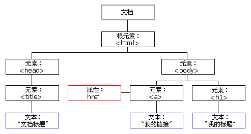

## 11.3 DOM三个级别和DHTML介绍

### DOM模型有三种

- DOM level 1：将html文档封装成对象。
- DOM level 2：在level 1的基础上添加新的功能，例如：对于事件和css样式的支持。
- DOM level 3：支持xml1.0的一些新特性。

### DHTML

- 动态的HTML，它不是一门语言，是多项技术综合体的简称
- 包括html，css，dom，javascript

### 这四种语言的职责

- Html：负责提供标签，封装数据，这样便于操作数据
- Css：负责提供样式，对标签中的数据进行样式定义
- Dom：负责将标签及其内容解析，封装成对象，对象中具有属性和行为
- Javascript：负责提供程序设计语言，对页面中的对象进行逻辑操作

## 11.4 BOM 和HTML DOM关系图

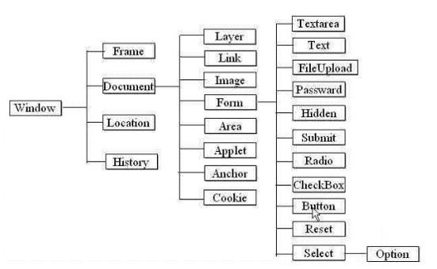

## 11.5 Node接口属性和方法

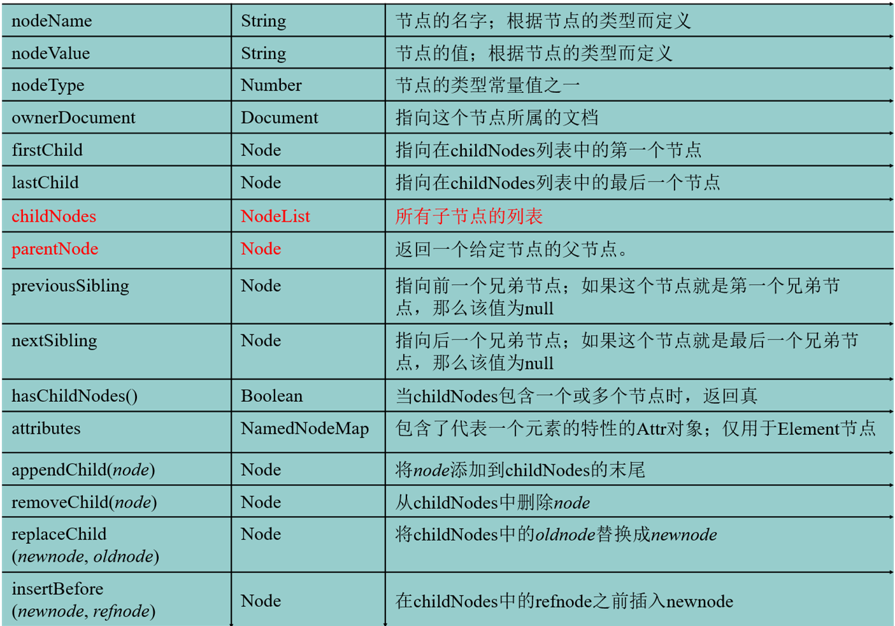

## 11.6 DOM中的Document对象

每个载入浏览器的 HTML 文档都会成为 Document 对象，Document：代表整个文档

### 11.6.1 常用属性

| 属性      | 描述                         |
| :------ | :------------------------- |
| all[]   | 提供对文档中所有 HTML 元素的访问  FF不支持 |
| forms[] | 返回对文档中所有 Form 对象引用         |
| body    | 提供对 &lt;body> 元素的直接访问      |

### 11.6.2 使用document查找标签

| 方法                     | 功能描述                          |
| :--------------------- | :---------------------------- |
| documentElement        | 获得文档的根节点                      |
| getElementById()       | 通过ID获得元素                      |
| getElementsByTagName() | 通过标签名获得元素.返回一个数组              |
| getElementsByName()    | 通过name属性 获得元素                 |
| write()                | 向文档写 HTML 表达式 或 JavaScript 代码 |

案例：
```javascript
// 获得id为username1的标签的value的值.
var input = document.getElementById("username1");
alert(input.value);
// 获得所有的input的标签的value的值.
var inputs = document.getElementsByTagName("input");
for(var i=0;i<inputs.length;i++){
    alert(inputs[i].value);
}
// 获得所有名称是username的标签的value的值.
var inputs = document.getElementsByName("username");
for(var i=0;i<inputs.length;i++){
    alert(inputs[i].getAttribute("value"));
}
```

### 11.6.3 Document创建标签

| 方法               | 功能描述     |
| :--------------- | :------- |
| createElement()  | 创建一个元素标签 |
| createTextNode() | 创建一个文本节点 |
| appendChild()    | 添加子节点    |

案例

```html
 <body>
      <ul id="city">
            <li>北京</li>
            <li>上海</li>
            <li>广州</li>
      </ul>
 </body>
 <script LANGUAGE="JavaScript">
      // 需求:创建一个<li>深圳</li> 将其放在ul中

      // 1.创建li标签   <li></li>
      var liElement = document.createElement("li");
      // 2.创建一个文本节点  深圳
      var textElement = document.createTextNode("深圳");
      // 3.将文本内容添加到li中   <li>深圳</li>
      liElement.appendChild(textElement);
      // 4.将li添加到ul中.(查找ul.)
      var city = document.getElementById("city");
      city.appendChild(liElement);
 </script>
```

## 11.7 Element对象:元素(标签)

### 11.7.1 元素对象操作属性

| 方法                       | 功能描述   |
| :----------------------- | :----- |
| getAttribute(name)       | 获得属性的值 |
| setAttribute(name,value) | 设置属性   |
| removeAttribute(name)    | 删除属性   |

在 Element 对象中查找 Element 对象

在Element对象的范围内，可以用来查找其他节点的唯一有效方法就是getElementsByTagName()方法。而该方法返回的是一个集合

案例：操作元素的属性
```javascript
// 操作属性  (对属性进行增加 修改 删除)      

// 查找元素.
var input = document.getElementsByTagName("input")[0];
//alert(input.getAttribute("value"));

// 修改name属性的值
// input.setAttribute("name","uname");
// alert(input.getAttribute("name"));

// 添加一个属性id
//alert(input.getAttribute("id"));
//input.setAttribute("id","username");
//alert(input.getAttribute("id"));

alert(input.name);
input.removeAttribute("name");
alert(input.getAttribute("name"));
```

### 11.7.2 在标签下查找标签
childNodes：获得所有的子节点.属性不是所有的浏览器都兼容

在标签下查找标签 只有getElementsByTagName()是有效的

案例
```javascript
// 查找第一个ul下的所有的li标签.
// 1.先查找第一个ul标签.
var city1 = document.getElementById("city1");
// 2.再找ul下的li标签.
//var childs = city1.childNodes;
//alert(childs.length);
var lis = city1.getElementsByTagName("li");
alert(lis.length);
```

## 11.8 Node对象:节点对象

### 11.8.1 Node中的常用的属性

- nodeName
  - 如果节点是元素节点，nodeName返回这个元素的名称
  - 如果是属性节点，nodeName返回这个属性的名称
  - 如果是文本节点，nodeName返回一个内容为#text 的字符串

- nodeType
  - Node.ELEMENT_NODE     ---1--- 元素节点
  - Node.ATTRIBUTE_NODE  ---2--- 属性节点
  - Node.TEXT_NODE             ---3--- 文本节点
- nodeValue
  - 如果给定节点是一个属性节点，返回值是这个属性的值
  - 如果给定节点是一个文本节点，返回值是这个文本节点内容
  - 如果给定节点是一个元素节点，返回值是 null

| 节点   | nodeName | nodeType | nodeValue |
| :--- | :------- | :------- | :-------- |
| 元素节点 | 标签名      | 1        | 没有 null   |
| 属性节点 | 属性名      | 2        | 属性的值      |
| 文本节点 | #text    | 3        | 文本内容      |

案例

```javascript
// 分别获得元素节点的 节点名称 节点类型 节点的值.

// 1.元素节点
var input = document.getElementById("username");
//alert(input.nodeName);            // output INPUT
//alert(input.nodeType);            // output 1
//alert(input.nodeValue);           // output null

// 2.属性节点
var attr = input.getAttributeNode("name"); // 获得属性节点.
//alert(attr.nodeName);         // output   name
//alert(attr.nodeType);         // output   2
//alert(attr.nodeValue);        // output   username

// 3.文本节点
var p = document.getElementsByTagName("p")[0];
var t = p.firstChild;
alert(t.nodeName);              // output  #text
alert(t.nodeType);              // output  3
alert(t.nodeValue);             // output  文本
```
### 11.8.2 节点名称、值和类型

- nodeName：其内容是给定节点的名字
  - 如果是元素节点，nodeName返回这个元素的名称(标签名)
  - 如果是属性节点，nodeName返回这个属性的名称(属性名)
  - 如果是文本节点，nodeName返回一个内容为#text 的字符串

- nodeType：返回一个整数，这个数值代表着给定节点的类型
  - Node.ELEMENT_NODE     ---1    --- 元素节点
  - Node.ATTRIBUTE_NODE  ---2    --- 属性节点
  - Node.TEXT_NODE             ---3    --- 文本节点

- nodeValue：返回给定节点的当前值（字符串）
  - 如果给定节点是一个属性节点，返回值是这个属性的值
  - 如果给定节点是一个文本节点，返回值是这个文本节点内容
  - 如果给定节点是一个元素节点，返回值是 null

### 11.8.3 节点对象的父节点、子节点及同辈节点

- 父节点： parentNode
  - parentNode 属性返回的节点永远是一个元素节点，因为只有元素节点才有可能包含子节点
  - document 节点的没有父节点

- 子节点
  - childNodes：获取指定节点的所有子节点集合
  - firstChild：获取指定节点的第一个子节点
  - lastChild：获取指定节点的最后一个子节点

- 同辈节点
  - nextSibling: 返回一个给定节点的下一个兄弟节点
  - previousSibling：返回一个给定节点的上一个兄弟节点

### 11.8.4 节点属性

- 节点属性attributes是Node接口定义的属性
- 节点属性attributes就是节点（特别是元素节点）的属性
- 事实上，attributes中包含的是一个节点的所有属性的集合
- attributes.getNameItem()和Element对象的getAttribute()方法类似

### 11.8.5 检测节点中是否有子节点和属性

- 查看是否存在子节点： hasChildNodes()

- 查看是否存在属性：hasAttributes()

- 即使节点中没有定义属性，其attributes属性仍然有效的，而且长度值为0。同样节点中的childNodes属性也是如此

- 当你想知道某个节点是否包含子节点和属性时，可以使用hasChildNodes()和hasAttributes()方法。但是，如果还想知道该节点中包含多少子节点和属性的话，仍要使用attributes和childNodes属性

- 在IE浏览器中，不存在hasAttributes()方法

### 11.8.6 节点的插入

- appendChild() 插入节点
- insertBefore(newNode,oldNode)
- 没有insertAfter()方法

### 11.8.7 删除和替换节点

- removeChild() 删除节点
- replaceChild(newNode,oldNode) 替换节点

### 11.8.8 移动节点

移动节点：由以下三种方法组合完成

- 查找节点
  - getElementById()：通过节点的id属性，查找对应节点。
  - getElementsByName()：通过节点的name属性，查找对应节点。
  - getElementsByTagName()：通过节点名称，查找对应节点。

- 插入节点
  - appendChild()方法
  - insertBefore()方法

- 替换节点：replaceChild()方法

### 11.8.9 复制节点

cloneNode(boolean)方法，其中，参数boolean是判断是否复制子节点

## 11.9 innerHTML

- 获得标签的html的内容及设置标签的html内容
- 浏览器几乎都支持该属性，但不是 DOM 标准的组成部分
- innerHTML 属性可以用来读，写某给定元素里的 HTML 内容
- innerHTML 属性多与div或span标签配合使用

获得焦点：onfocus，失去焦点：onblur

innerHTML的案例
```html
var table = "
<table width='400' border='1'>
      <tr>
            <td>1</td><td>2</td>
      </tr>
      <tr>
            <td>1</td><td>2</td>
      </tr>
</table>";

function createTable(){
      document.getElementById("divv").innerHTML = table;
}
```
使用innerHTML生成动态的表格

# 12. JS中的事件

HTML 4.0 的新特性之一是有能力使 HTML 事件触发浏览器中的动作（action），比如当用户点击某个 HTML 元素时启动一段 JavaScript。下面是一个属性列表，这些属性可插入 HTML 标签来定义事件动作。

事件通常与函数配合使用，这样就可以通过发生的事件来驱动函数执行。

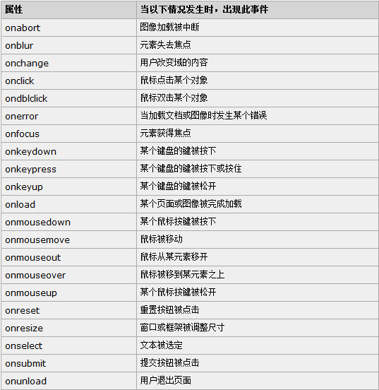

| 事件          | 描述      |
| :---------- | :------ |
| onclick     | 单击      |
| ondblclick  | 双击      |
| onchange    | 列表框改变事件 |
| onmouseover | 鼠标放在上面  |
| onmouseout  | 鼠标离开    |
| onmousemove | 鼠标移动    |
| onload      | 页面加载时间  |
| onunload    | 页面的卸载事件 |
| onblur      | 失去焦点    |
| onfocus     | 获得焦点    |
| onkeyup     | 键盘事件    |
| onkeydown   | 键盘事件    |

使用 HTML DOM 来分配事件
```html
<script>
document.getElementById("myBtn").onclick=function(){displayDate()};
</script>
```

## 12.1 鼠标移动事件

onmouseout/onmouseover
```html
<html>
     <script language="JavaScript">
        function mouseovertest(){
           document.getElementById("info").value = "鼠标在输入框上";}
        function mouseouttest(){
          document.getElementById("info").value= "鼠标在输入框外";}
     </script>
     <body>
     <input type="text" id="info" onmouseover="mouseovertest();"
            onmouseout="mouseouttest();"/>
     </body>
</html>
```
## 12.2 鼠标点击事件
onclick/ondblclick
```html
<html>
      <script language="JavaScript">
         function addFile(){
                var file = document.createElement('input');
                file.setAttribute('id', 'temp_file');
                file.setAttribute('type', 'file');
                document.body.appendChild(file);
 }
    </script>
    <body>
      <form action="uploadFile" method="post">
     <input type="button" value="添加附件" onclick="addFile();">
      </form>
    </body>
</html>
```
## 12.3 加载与卸载事件
onload/unload

```html
 <html>
  <head>
    <script Language="JavaScript">
      function loadform(){
        alert("这是一个自动装载例子!");
      }
      function unloadform(){
        alert("这是一个卸载例子!");
      }
   </script>
  </head>
  <body onload=“loadform()” onbeforeunload=“unloadform()”>
      <a href=“http://www.itcast.cn”>传智播客</a>
   </body>
</html>
```
## 12.4 聚焦与离焦事件
onfocus/onblur

```html
<html>
<script language="JavaScript">
function checkDate(){
	var date1 = document. getElementById("testdate").value;
	if(date1.match("^\\d{8}$")==null){alert("wrong");}
    else{alert("right");}
}
</script>
<body>
请输入一个八位数字<input type="text" id="testdate" onblur="checkDate();">
</body>
</html>
```
## 12.5 键盘事件
keydown/keyup/keypress

```html
<html>
<script language="JavaScript">
function submitform(e){
	if(e.keyCode){
		if (e.keyCode == 13) {document.forms(0).submit();}  
	}else{
	    if (e.which == 13) {document.forms(0).submit();}  
	}
           }
</script>
<body>
没有按钮的表单，用回车键提交
<form action="login">
    <input type="text" name="username" onkeypress="submitform(event);"/>
</form>
</body>
</html>
```
## 12.6 提交与重置事件
submit/reset

```html
<html>
<script language="JavaScript">
function isDelete(){
var isdelete= window.confirm();
if(isdelete){return true;}
         else{return false;}
}
</script>
<body>
<form action="delete" onsubmit="return isDelete();">
姓名：小明  年龄：23  学校：清华大学
<input type="submit" value="删除">
</form>
</body>
</html>
```
## 12.7 选择与改变事件
select/change

范例代码(表单联动)
```html
<html>
<script src="content.js" language="javascript"></script>
   <body>
        <select id="provice" onchange="changecontent();">
            <option value="0">请选择省份</option>
            <option value="1">河北</option>
            <option value="2">山东</option>
        </select>
        <select id="city"></select>
    </body>
</html>
```
