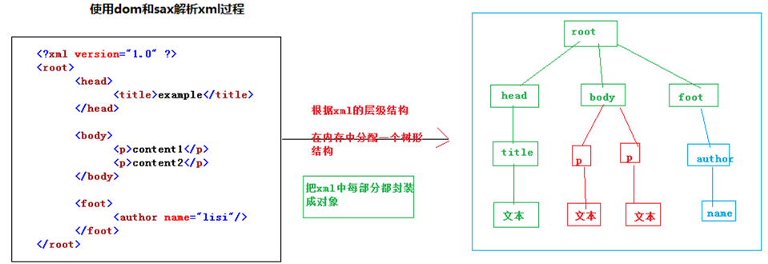
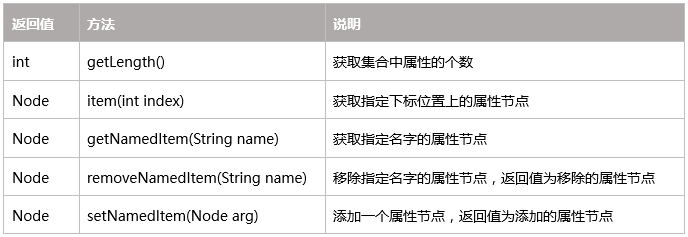
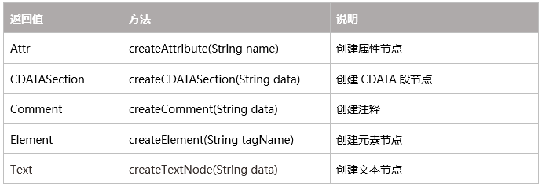
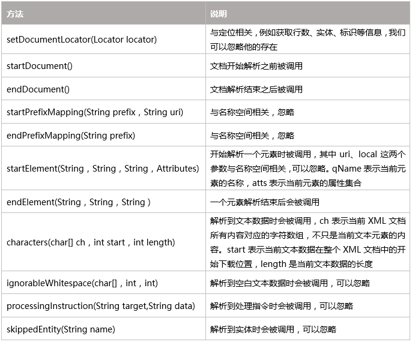
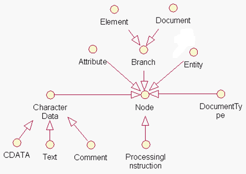
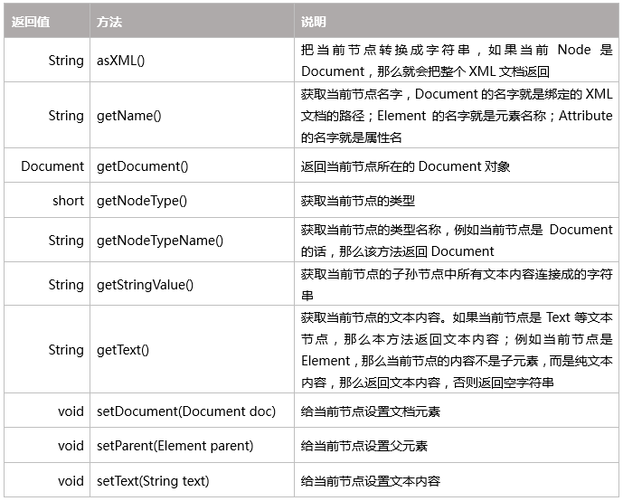
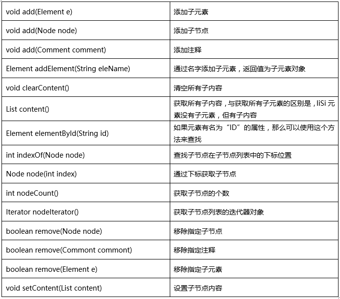
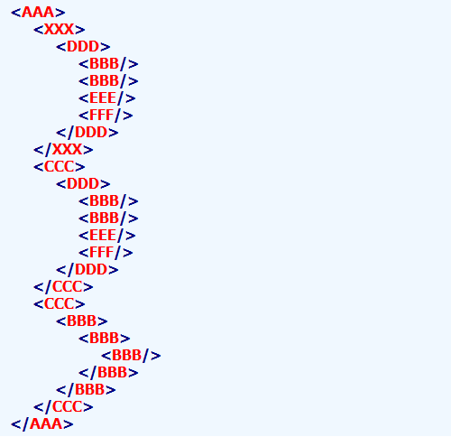

# 相关阅读

1. [XML约束](http://blog.csdn.net/axi295309066/article/details/52761609)
2. [Xml 格式数据的生成和解析](http://blog.csdn.net/axi295309066/article/details/52760959)
3. [XML解析器](http://blog.csdn.net/axi295309066/article/details/52761771)


# 1. 操作XML文档概述

## 1.1 如何操作XML文档

XML文档也是数据的一种，对数据的操作也不外乎是“增删改查”。也被大家称之为“CRUD”

- C：Create
- R：Retrieve
- U：Update
- D：Delete

## 1.2 XML解析技术

XML解析方式分为两种：DOM（Document Object Model）和SAX（Simple API for XML）。这两种方式不是针对Java语言来解析XML的技术，而是跨语言的解析方式。例如DOM还在Javascript中存在！

DOM是W3C组织提供的解析XML文档的标准接口，而SAX是社区讨论的产物，是一种事实上的标准。

DOM和SAX只是定义了一些接口，以及某些接口的缺省实现，而这个缺省实现只是用空方法来实现接口。一个应用程序如果需要DOM或SAX来访问XML文档，还需要一个实现了DOM或SAX的解析器，也就是说这个解析器需要实现DOM或SAX中定义的接口。提供DOM或SAX中定义的功能。

# 2. 解析原理

## 2.1 DOM解析原理

使用DOM要求解析器把整个XML文档装载到一个Document对象中。Document对象包含文档元素，即根元素，根元素包含N多个子元素…

一个XML文档解析后对应一个Document对象，这说明使用DOM解析XML文档方便使用，因为元素与元素之间还保存着结构关系。

优点：使用DOM，XML文档的结构在内存中依然清晰。元素与元素之间的关系保留了下来！

缺点：如果XML文档过大，那么把整个XML文档装载进内存，可能会出现内存溢出的现象！

## 2.2 设置Java最大内存

运行Java程序，指定初始内存大小，以及最大内存大小。

java -Xms20m -Xmx100m MyClass


## 2.3 SAX解析原理

DOM会一行一行的读取XML文档，最终会把XML文档所有数据存放到Document对象中。SAX也是一行一行的读取XML文档，但是当XML文档读取结束后，SAX不会保存任何数据，同时整个解析XML文档的工作也就结束了。

但是，SAX在读取一行XML文档数据后，就会给感兴趣的用户一个通知！例如当SAX读取到一个元素的开始时，会通知用户当前解析到一个元素的开始标签。而用户可以在整个解析的过程中完成自己的业务逻辑，当SAX解析结束，不会保存任何XML文档的数据。

优点：使用SAX，不会占用大量内存来保存XML文档数据，效率也高。

缺点：当解析到一个元素时，上一个元素的信息已经丢弃，也就是说没有保存元素与元素之间的结构关系，这也大大限制了SAX的使用范围。如果只是想查询XML文档中的数据，那么使用SAX是最佳选择！



## 2.4 SAX解析过程

采用事件驱动，边读边解析：从上到下，一行一行的解析，解析到某一个对象，把对象名称返回

使用SAX方式不会造成内存溢出，实现查询；使用SAX方式不能实现增删改操纵

使用DOM方式解析XML时，如果文件过大，会造成内存溢出，优点是DOM方式很方便的实现增删改操作

# 3. 解析器概述

## 3.1 什么是XML解析器

DOM、SAX都是一组解析XML文档的规范，其实就是接口，这说明需要有实现者能使用，而解析器就是对DOM、SAX的实现了。一般解析器都会实现DOM、SAX两个规范！

- Crimson(sun)：JDK1.4之前，Java使用的解析器。性能效差，可以忘记它了！

- Xerces(IBM)：IBM开发的DOM、SAX解析器，现在已经由Apache基金会维护。是当前最为流行的解析器之一！在1.5之后，已经添加到JDK之中，也是JAXP的默认使用解析器，但不过在JDK中的包名与Xerces不太一样。例如：org.apache.xerces包名改为了com.sun.org.apache.xerces.internal包名，也就是说JDK1.5中的Xerces是被包装后的XML解析器，但二者区别很小。

- Aelfred2(dom4j)：DOM4J默认解析器，当DOM4J找不到解析器时会使用他自己的解析器。

# 4. JAXP概述

## 4.1 什么是JAXP

JAXP是由Java提供的，用于隐藏底层解析器的实现。Java要求XML解析器去实现JAXP提供的接口，这样可以让用户使用解析器时不依赖特定的XML解析器。

JAXP本身不是解析器（不是Xerces），也不是解析方式（DOM或SAX），它只是让用户在使用DOM或SAX解析器时不依赖特定的解析器。

当用户使用JAXP提供的方式来解析XML文档时，用户无需编写与特定解析器相关的代码，而是由JAXP通过特定的方式去查找解析器，来解析XML文档。


## 4.2 JAXP对DOM的支持

```java
DocumentBuilderFactory factory = DocumentBuilderFactory.newInstance();
DocumentBuilder builder = factory.newDocumentBuilder();
Document doc = builder.parse("src/students.xml");
```
在javax.xml.parsers包中，定义了DOM解析器工厂类DocumentBuilderFactory，用于产生DOM解析器。DocumentBuilderFactory是一个抽象类，它有一个静态方法newInstance()，可以返回一个本类的实例对象。其实该方法返回的是DocumentBuilderFactory类的子类的实例（即工厂实例对象）。那么这个子类又是哪个子类呢？其实这个子类是由XML解析器提供商提供的，不同的厂商提供的工厂类对抽象工厂的实现是不同的。然后由工厂实例创建解析器对象。

那么newInstance()这个方法又是如果找到解析器提供商的工厂类的呢？此方法使用下面有序的查找过程来确定要加载的DocumentBuilderFactory实现类：

使用javax.xml.parsers.DocumentBuilderFactory系统属性。如果设置了这个系统属性的值，那么newInstance()方法就以这个属性的值来构造这个工厂的实例。通过下面的方法可以设置这个系统属性值。

```java
System.setProperty(“javax.xml.parsers.DocumentBuilderFactory”, “工厂实现类名字”);
```

我们不建议大家用上面的方法来硬编码这个系统属性的值，如果这样设置，假如将来需要更换解析器，就必需修改代码。

如果你没有设置上面的系统属性，newInstance()方法就会采用下面的途径来查找抽象工厂的实现类。第二个途径在查找JRE下的lib子目录下的jaxp.properties文件。如果这个文件存在，那么就读取这个文件。我们可以在%JAVA_HOME%\jre\lib\目录下创建一个jaxp.properties文件。在这个文件中给出一个键值对。如下所示：

```java
javax.xml.parsers.DocumentBuilderFactory=工厂实现类名字
```
这个key名字必须是javax.xml.parsers.DocumentBuilderFactory，而相对应的值也必须设置类路径。

如果通过前两种途径下没有找到工厂的实现类，那么就需要使用服务API。这个服务API实际上是查找一个JAR文件的META-INF\ services\ javax.xml.parsers.DocumentBuilderFactory这个文件（该文件无扩展名）。如果找到了这个文件，就以这个文件的内容做为工厂实现类。这种方式被大多数解析器提供商所采用。在它们发布的解析器JAR包中往往会找到上述文件。然后在这个文件当中指定自己解析器的工厂类的名字。我们只需要把这个JAR文件的路径写到类路径（classpath）中就可以了。但要注意的是，如果在你的classpath中有多个解析器的JAR包路径，这时以前面的类路径优先。

如果说在前三种途径中都没有找到工厂实现类，那么就使用平台缺省工厂实现类。

在JAXP的早期的版本（5.0以前）中，除了JAXP API外，还包含了一个叫做Crimson的解析器。从JAXP1.2开始，Sun公司对Apache的Xerces解析器重新包装了一下，并将org.apache.xerces包名改为了com.sun.org.apache.xerces.internal，然后在JAXP的开发包中一起提供，作为缺省的解析器。我们所使用的JDK1.5中包含的缺省解析器就是被重新包装过后的Xerces解析器。

在获取到某个特定解析器厂商的DocumentBuilderFactory后，那么这个工厂对象创建出来的解析器对象当然就是自己厂商的解析器对象了。

## 4.3 JAXP对SAX的支持

```java
SAXParserFactory factory = SAXParserFactory.newInstance();
SAXParser parser = factory.newSAXParser();
parser.parse("src/students.xml", new DefaultHandler() {
    public void startDocument() throws SAXException {
        System.out.println("解析开始");
    }

    public void endDocument() throws SAXException {
        System.out.println("解析结束");
    }

    public void processingInstruction(String target, String data)
            throws SAXException {
        System.out.println("处理指令");
    }

    public void startElement(String uri, String localName, String qName,
            Attributes atts) throws SAXException {
        System.out.println("元素开始：" + qName);
    }

    public void characters(char[] ch, int start, int length)
            throws SAXException {
        System.out.println("文本内容：" + new String(ch, start, length).trim());
    }

    public void endElement(String uri, String localName, String qName)
            throws SAXException {
        System.out.println("元素结束：" + qName);
    }
});

```
JAXP对SAX的支持与JAXP对DOM的支持是相同的，这里就不在赘述！

# 5. JDOM和DOM4J

## 5.1 JDOM和DOM4J概述

JDOM和DOM4J都是针对Java解析XML设计的方式，它们与DOM相似。但DOM不是只针对Java，DOM是跨语言的，DOM在Javascript中也可以使用。而JDOM和DOM4J都是专业为Java而设计的，使用JDOM和DOM4J，对Java程序员而言会更加方便。

## 5.2 JDOM和DOM4J比较

JDOM与DOM4J相比，DOM4J完胜！！！所以，我们应该在今后的开发中，把DOM4J视为首选。

在2000年，JDOM开发过程中，因为团队建议不同，分离出一支队伍，开发了DOM4J。DOM4J要比JDOM更加全面。

## 5.3 DOM4J查找解析器的过程

DOM4J首先会去通过JAXP的查找方法去查找解析器，如果找到解析器，那么就使用之；否则会使用自己的默认解析器Aelfred2。

DOM4J对DOM和SAX都提供了支持，可以把DOM解析后的Document对象转换成DOM4J的Document对象，当然了可以把DOM4J的Document对象转换成DOM的Document对象。

DOM4J使用SAX解析器把XML文档加载到内存，生成DOM对象。当然也支持事件驱动的方式来解析XML文档。

# 6. XML解析之JAXP（DOM）

##6.1 JAXP获取解析器

### 6.1.1 JAXP相关包

- JAXP相关开发包：javax.xml
- DOM相关开发包：org.w3c.dom
- SAX相关开发包：org.xml.sax

### 6.1.2 JAXP与DOM、SAX解析器的关系

JAXP的作用只是为了让使用者不依赖某一特定DOM、SAX的解析器实现，当使用JAXP API时，使用者直接接触的就是JAXP API，而不用接触DOM、SAX的解析器实现API。

### 6.1.3 JAXP获取DOM解析器

当我们需要解析XML文档时，首先需要通过JAXP API解析XML文档，获取Document对象。然后用户就需要使用DOM API来操作Document对象了。
```java
DocumentBuilderFactory factory = DocumentBuilderFactory.newInstance();
factory.setValidating(false);
DocumentBuilder builder = factory.newDocumentBuilder();
Document doc = builder.parse("src/students.xml");
```
### 6.1.4 JAXP保存Document

当我们希望把Document保存到文件中去时，可以使用Transformer对象的transform()方法来完成。想获取Transformer对象，需要使用TransformerFactory对象。
与JAXP获取DOM解析器一样，隐藏了底层解析器的实现。也是通过抽象工厂来完成的，这里就不在赘述了。
```java
TransformerFactory tFactory = TransformerFactory.newInstance();
Transformer transformer = tFactory.newTransformer();
trans.setOutputProperty(OutputKeys.ENCODING, "UTF-8");
trans.setOutputProperty(OutputKeys.DOCTYPE_SYSTEM, "students.dtd");
trans.setOutputProperty(OutputKeys.INDENT, "yes");
Source source = new DOMSource(doc);
Result result = new StreamResult(xmlName);
transformer.transform(source, result);
```
Transformer类的transform()方法的两个参数类型为：Source和Result，DOMSource是Source的实现类，StreamResult是Result的实现类。

### 6.1.5 JAXP创建Document

有时我们需要创建一个Document对象，而不是从XML文档解析而来。这需要使用DocumentBuider对象的newDocument()方法。
```java
DocumentBuilderFactory factory = DocumentBuilderFactory.newInstance();
DocumentBuilder builder = factory.newDocumentBuilder();
Document doc = builder.newDocument();
doc.setXmlVersion("1.0");
doc.setXmlStandalone(true);
```
### 6.1.6 学习DOM之前，先写两个方法

- Document getDocument(String xmlName)：通过xmlName获取Document对象；
- void saveDocument(Document doc, String xmlName)：保存doc到xmlName文件中。

# 7. DOM API概述

## 7.1 Document对应XML文档
无论使用什么DOM解析器，最终用户都需要获取到Document对象，一个Document对象对应整个XML文档。也可以这样说，Document对象就是XML文档在内存中的表示形式。

通常我们最为“关心”的就是文档的根元素。所以我们必须要把Document获取根元素的方法记住：Element getDocumentElement()。然后通过根元素再一步步获取XML文档中的数据。

## 7.2 DOM API中的类
在DOM中提供了很多接口，用来描述XML文档中的组成部分。其中包括：

- 文档（Document）
- 元素（Element）
- 属性（Attr）
- 文本（Text）
- 注释（Comment）
- CDATA段（CDATASection）

等等。无论是哪种XML文档组成部分，都是节点（Node）的子接口。


## 7.3 Node方法介绍

Node基本方法：

- String getNodeName()

获取当前节点的名字。如果当前节点是Element，那么返回元素名称。如果当前节点是Text那么返回#text。如果当前节点是Document那么返回#document

- String getNodeValue()

获取当前节点的值。只有文本节点有值，其它节点的值都为null

- String getTextContent()

获取当前节点的文本字符串。如果当前节点为Text，那么获取节点内容。如果当前节点为Element，那么获取元素中所有Text子节点的内容。例如当前节点为：&lt;name>zhangSan&lt;/name>，那么本方法返回zhangSan。如果当前节点为：&lt;student>&lt;name>zhangSan&lt;/name>&lt;age>23&lt;/age>&lt;sex>male&lt;/sex>&lt;/student>，那么本方法返回zhangSan23male。

- short getNodeType()

获取当前节点的类型。Node中有很多short类型的常量，可以通过与这些常量的比较来判断当前节点的类型。if(node.getNodeType() == Node.ELEMENT_NODE)；

Node获取子节点和父节点方法，只有Document和Element才能使用这些方法：


| 返回值      | 方法              | 说明                             |
| :------- | :-------------- | :----------------------------- |
| NodeList | getChildNodes() | 获取当前节点的所有子节点                   |
| Node     | getFirstNode()  | 获取当前节点的第一个子节点                  |
| Node     | getLastNode()   | 获取当前节点的最后一个子节点                 |
| Node     | getParentNode() | 获取当前节点的父节点。注意Document的父节点为null |

NodeList表示节点列表，它有两个方法

| 返回值  | 方法              | 说明        |
| :--- | :-------------- | :-------- |
| int  | getLength()     | 获取集合长度    |
| Node | item(int index) | 获取指定下标的节点 |

Node获取弟兄节点的方法，只有Element才能使用这些方法：

- Node getNextSibling()：获取当前节点的下一个兄弟节点；
- Node getPreviousSibling()：获取当前节点的上一个兄弟节点。

Node添加、替换、删除子节点方法：

- Node appendChild(Node newChild)

把参数节点newChild添加到当前节点的子节点列表的末尾处。返回值为被添加的子节点newChild对象，方便使用链式操作。如果newChild在添加之前已经在文档中存在，那么就是修改节点的位置了；

- Node insertBefore(Node newChild, Node refNode)

把参数节点newChild添加到当前节点的子节点refNode之前。返回值为被添加的子节点newChild对象，方便使用链式操作。如果refNode为null，那么本方法与appendNode()方法功能相同。如果newChild节点在添加之前已经在文档中存在，那么就是修改节点的位置了。

- Node removeNode(Node oldChild)

从当前节点中移除子元素oldChild。返回值为被添加的子节点oldChild对象，方便使用链式操作。

- Node replaceNode(Node newChild, Node oldChild)

将当前节点的子节点oldChild替换为newChild。

Node获取属性集合方法，只有Element可以使用：

- NamedNodeMap getAttributes()：返回当前节点的属性集合。

NamedNodeMap表示属性的集合，方法如下：



Node的判断方法：

- boolean hasChildNodes()：判断当前节点是否有子节点
- boolean hasAttribute()：判断当前节点是否有属性

## 7.4 Docment方法介绍
创建节点方法：



获取子元素方法：

- Element getElementById(String elementId)

通过元素的ID属性获取元素节点，如果没有DTD指定属性类型为ID，那么这个方法将返回null

- NodeList getElementsByTagName(String tagName)

获取指定元素名称的所有元素

- Element getDocumentElement()：获取文档元素，即获取根元素

文档声明相关方法

| 返回值    | 方法                 | 说明                   |
| :----- | :----------------- | :------------------- |
| String | getXmlVersion()    | 获取文档声明的version属性值    |
| String | getXmlEncoding()   | 获取文档声明的encoding属性值   |
| String | getXmlStandalone() | 获取文档声明的standalone属性值 |
| void   | setXmlVersion()    | 设置文档声明version属性值     |
| void   | setXmlStandalone() | 设置文档声明standalone属性值  |

## 7.5 Element方法介绍
获取方法：

- NodeList getElementsByTagName(String tagName)

获取当前元素的指定元素名称的所有子元素

- String getTagName()

获取当前元素的元素名。调用元素节点的getNodeName()也是返回名

属性相关方法

| 返回值     | 方法                                      | 说明                     |
| :------ | :-------------------------------------- | :--------------------- |
| String  | getAttribute(String name)               | 获取当前元素指定属性名的属性值        |
| Attr    | getAttributeNode(String name)           | 获取当前元素指定属性名的属性节点       |
| boolean | hasAttribute(String name)               | 判断当前元素是否有指定属性          |
| void    | removeAttribute(String name)            | 移除当前元素的指定属性            |
| void    | removeAttributeNode(Attr attr)          | 移除当前元素的指定属性            |
| void    | setAttribute(String name, String value) | 为当前元素添加或修改属性           |
| Attr    | setAttributeNode(Attr attr)             | 为当前元素添加或修改属性，返回值为添加的属性 |

## 7.6 Attr方法介绍

| 返回值     | 方法                     | 说明                |
| :------ | :--------------------- | :---------------- |
| String  | getName()              | 获取当前属性节点的属性名      |
| String  | getValue()             | 获取当前属性节点的属性值      |
| void    | setValue(String value) | 设置当前属性节点的属性值      |
| boolean | isId()                 | 判断当前属性节点是否为ID类型属性 |
实现代码
```java
/
 * 实现jaxp操作xml
 *
 */
public class TestJaxp {

    public static void main(String[] args) throws Exception {
        //selectAll();
        //selectSin();
        //addSex();
        //modifySex();
        //delSex();
        listElement();
    }

    //遍历节点，把所有元素名称打印出来
    public static void listElement() throws Exception {
        /*
         * 1、创建解析器工厂
         * 2、根据解析器工厂创建解析器
         * 3、解析xml，返回document
         *
         * ====使用递归实现=====
         * 4、得到根节点
         * 5、得到根节点子节点
         * 6、得到根节点子节点的子节点
         * */
        //创建解析器工厂
        DocumentBuilderFactory builderFactory = DocumentBuilderFactory.newInstance();
        //创建解析器
        DocumentBuilder builder = builderFactory.newDocumentBuilder();
        //得到document
        Document document = builder.parse("src/person.xml");

        //编写一个方法实现遍历操作
        list1(document);
    }

    //递归遍历的方法
    private static void list1(Node node) {
        //判断是元素类型时候才打印
        if(node.getNodeType() == Node.ELEMENT_NODE) {           
            System.out.println(node.getNodeName());
        }

        //得到一层子节点
        NodeList list = node.getChildNodes();
        //遍历list
        for(int i=0;i<list.getLength();i++) {
            //得到每一个节点
            Node node1 = list.item(i);
            //继续得到node1的子节点
            //node1.getChildNodes()
            list1(node1);
        }
    }

    //删除<sex>nan</sex>节点
    public static void delSex() throws Exception {
        /*
         * 1、创建解析器工厂
         * 2、根据解析器工厂创建解析器
         * 3、解析xml，返回document
         *
         * 4、获取sex元素
         * 5、获取sex的父节点
         * 6、删除使用父节点删除 removeChild方法
         *
         * 7、回写xml
         * */
        //创建解析器工厂
        DocumentBuilderFactory builderFactory = DocumentBuilderFactory.newInstance();
        //创建解析器
        DocumentBuilder builder = builderFactory.newDocumentBuilder();
        //得到document
        Document document = builder.parse("src/person.xml");
        //得到sex元素
        Node sex1 = document.getElementsByTagName("sex").item(0);
        //得到sex1父节点
        Node p1 = sex1.getParentNode();
        //删除操作
        p1.removeChild(sex1);
        //回写xml
        TransformerFactory transformerFactory = TransformerFactory.newInstance();
        Transformer transformer = transformerFactory.newTransformer();
        transformer.transform(new DOMSource(document), new StreamResult("src/person.xml"));
    }

    //修改第一个p1下面的sex内容是nan
    public static void modifySex() throws Exception {
        /*
         * 1、创建解析器工厂
         * 2、根据解析器工厂创建解析器
         * 3、解析xml，返回document
         *
         * 4、得到sex item方法
         * 5、修改sex里面的值  setTextContent方法
         *
         * 6、回写xml
         * */
        //创建解析器工厂
        DocumentBuilderFactory builderFactory = DocumentBuilderFactory.newInstance();
        //创建解析器
        DocumentBuilder builder = builderFactory.newDocumentBuilder();
        //得到document
        Document document = builder.parse("src/person.xml");

        //得到sex
        Node sex1 = document.getElementsByTagName("sex").item(0);
        //修改sex值
        sex1.setTextContent("nan");
        //回写xml
        TransformerFactory transformerFactory = TransformerFactory.newInstance();
        Transformer transformer = transformerFactory.newTransformer();
        transformer.transform(new DOMSource(document), new StreamResult("src/person.xml"));
    }

    //在第一个p1下面（末尾）添加 <sex>nv</sex>
    public static void addSex() throws Exception {
        /*
         * 1、创建解析器工厂
         * 2、根据解析器工厂创建解析器
         * 3、解析xml，返回document
         *
         * 4、得到第一个p1
         *  - 得到所有p1，使用item方法下标得到
         * 5、创建sex标签 createElement
         * 6、创建文本 createTextNode
         * 7、把文本添加到sex下面 appendChild
         * 8、把sex添加到第一个p1下面
         *
         * 9、回写xml
         * */
        //创建解析器工厂
        DocumentBuilderFactory builderFactory = DocumentBuilderFactory.newInstance();
        //创建解析器
        DocumentBuilder builder = builderFactory.newDocumentBuilder();
        //得到document
        Document document = builder.parse("src/person.xml");

        //得到所有的p1
        NodeList list = document.getElementsByTagName("p1");
        //得到第一个p1
        Node p1 = list.item(0);
        //创建标签
        Element sex1 = document.createElement("sex");
        //创建文本
        Text text1 = document.createTextNode("nv");
        //把文本添加到sex1下面
        sex1.appendChild(text1);
        //把sex1添加到p1下面
        p1.appendChild(sex1);
        //回写xml
        TransformerFactory transformerFactory = TransformerFactory.newInstance();
        Transformer transformer = transformerFactory.newTransformer();
        transformer.transform(new DOMSource(document), new StreamResult("src/person.xml"));
    }

    //查询xml中第一个name元素的值
    public static void selectSin() throws Exception {
        /*
         * 1、创建解析器工厂
         * 2、根据解析器工厂创建解析器
         * 3、解析xml，返回document
         *
         * 4、得到所有name元素
         * 5、使用返回集合，里面方法 item，下标获取具体的元素
         * 6、得到具体的值，使用 getTextContent方法
         *
         * */
        //创建解析器工厂
        DocumentBuilderFactory builderFactory = DocumentBuilderFactory.newInstance();
        //创建解析器
        DocumentBuilder builder = builderFactory.newDocumentBuilder();
        //解析xml，得到document
        Document document = builder.parse("src/person.xml");
        //得到所有的name元素
        NodeList list = document.getElementsByTagName("name");
        //使用下标 得到第一个元素
        Node name1 = list.item(1);
        //得到name里面的具体的值
        String s1 = name1.getTextContent();
        System.out.println(s1);
    }

    //查询所有name元素的值
    private static void selectAll() throws Exception {
        //查询所有name元素的值
        /*
         * 1、创建解析器工厂
         * 2、根据解析器工厂创建解析器
         * 3、解析xml返回document
         *  
         * 4、得到所有的name元素
         * 5、返回集合，遍历集合，得到每一个name元素
         * */
        //创建解析器工厂    atl / : 代码提示
        DocumentBuilderFactory builderFactory = DocumentBuilderFactory.newInstance();
        //创建解析器
        DocumentBuilder builder = builderFactory.newDocumentBuilder();
        //解析xml返回document
        Document document = builder.parse("src/person.xml");
        //得到name元素
        NodeList list = document.getElementsByTagName("name");
        //遍历集合
        for(int i=0;i<list.getLength();i++) {
            Node name1 = list.item(i); //得到每一个name元素
            //得到name元素里面的值
            String s = name1.getTextContent();
            System.out.println(s);
        }
    }
}
```

# 8.  SAX

## 8.1 SAX解析原理

首先我们想一下，DOM解析器是不是需要把XML文档遍历一次，然后把每次读取到的数据转换成节点对象（到底哪一种节点对象，这要看解析时遇到了什么东西）保存起来，最后生成一个Document对象返回。也就是说，当你调用了builder.parse(“a.xml”)后，这个方法就会把XML文档中的数据转换成节点对象保存起来，然后生成一个Document对象。这个解析XML文档的过程在parse()方法调用结束后也就结束了。我们的工作是在解析之后，开始对Document对象进行操作。

但是SAX不同，当SAX解析器的parse()方法调用结束后，不会给我们一个Document对象，而是什么都不给。SAX不会把XML数据保存到内存中，如果我们的解析工作是在SAX解析器的parse()方法调用结束后开始，那么就已经晚了！！！这说明我们必须在SAX解析XML文档的同时完成我们的工作。

SAX解析器在解析XML文档的过程中，读取到XML文档的一个部分后，会调用ContentHandler（内容处理器）中的方法。例如当SAX解析到一个元素的开始标签时，它会调用ContentHandler的startElement()方法；在解析到一个元素的结束标签时会调用ContentHandler的endElement()方法。

ContentHandler是一个接口，我们的工作是编写该接口的实现类，然后创建实现类的对象，在SAX解析器开始解析之前，把我们写的内容处理类对象交给SAX解析器，这样在解析过程中，我们的内容处理中的方法就会被调用了。

## 8.2 获取SAX解析器

与DOM相同，你应该通过JAXP获取SAX解析器，而不是直接使用特定厂商的SAX解析器。JAXP查找特定厂商的SAX解析器实现的方式与查找DOM解析器实现的方式完全相同，这里就不在赘述了。

```java
SAXParserFactory factory = SAXParserFactory.newInstance();
javax.xml.parsers.SAXParser parser = factory.newSAXParser();
parser.parse("src/students.xml", new MyContentHandler());
```
上面代码中，MyContentHandler就是我们自己需要编写的ContentHandler的实现类对象。

## 8.3 内容处理器

org.xml.sax.ContentHandler中的方法：



org.xml.sax.helpers.DefualtHandler对ContentHandler做了空实现，所以我们可以自定义内容处理器时可以继承DefaultHandler类。

## 8.4 SAX应用

## 8.5 测试SAX

```java
public class SAXTest {
	@Test
	public void testSAX() throws ParserConfigurationException, SAXException, IOException {
		SAXParserFactory factory = SAXParserFactory.newInstance();
		SAXParser parser = factory.newSAXParser();
		parser.parse("src/students.xml", new MyContentHandler());
	}
	private static class MyContentHandler extends DefaultHandler {
		@Override
		public void startDocument() throws SAXException {
			System.out.println("开始解析...");
		}
		@Override
		public void endDocument() throws SAXException {
			System.out.println("解析结束...");
		}
		@Override
		public void startElement(String uri, String localName, String qName,
				Attributes atts) throws SAXException {
			System.out.println(qName + "元素解析开始");
		}
		@Override
		public void endElement(String uri, String localName, String qName)
				throws SAXException {
			System.out.println(qName + "元素解析结束");
		}
		@Override
		public void characters(char[] ch, int start, int length)
				throws SAXException {
			String s = new String(ch, start, length);
			if(s.trim().isEmpty()) {
				return;
			}
			System.out.println("文本内容：" + s);
		}
		@Override
		public void ignorableWhitespace(char[] ch, int start, int length)
				throws SAXException {

		}
		@Override
		public void processingInstruction(String target, String data)
				throws SAXException {
			System.out.println("处理指令");
		}
	}
}
```
## 8.6 使用SAX打印XML文档

```java
public class SAXTest2 {
	@Test
	public void testSAX() throws
ParserConfigurationException, SAXException, IOException {
		SAXParserFactory factory = SAXParserFactory.newInstance();
		SAXParser parser = factory.newSAXParser();
		parser.parse("src/students.xml", new MyContentHandler());
	}
	private static class MyContentHandler extends DefaultHandler {
		@Override
		public void startDocument() throws SAXException {
			System.out.println("<?xml version='1.0' encoding='utf-8'?>");
		}

		@Override
		public void startElement(String uri, String localName, String qName,
				Attributes atts) throws SAXException {
			StringBuilder sb = new StringBuilder();
			sb.append("<").append(qName);
			for(int i = 0; i < atts.getLength(); i++) {
				sb.append(" ");
				sb.append(atts.getQName(i));
				sb.append("=");
				sb.append("'");
				sb.append(atts.getValue(i));
				sb.append("'");
			}
			sb.append(">");
			System.out.print(sb);
		}

		@Override
		public void endElement(String uri, String localName, String qName)
				throws SAXException {
			System.out.print("</" + qName + ">");
		}

		@Override
		public void characters(char[] ch, int start, int length)
				throws SAXException {
			System.out.print(new String(ch, start, length));
		}
	}
}
```

# 9. DOM4J

## 9.1 DOM4J是什么

DOM4J是针对Java开发人员专门提供的XML文档解析规范，它不同与DOM，但与DOM相似。DOM4J针对Java开发人员而设计，所以对于Java开发人员来说，使用DOM4J要比使用DOM更加方便。

DOM4J对DOM和SAX提供了支持，使用DOM4J可以把org.dom4j.document转换成org.w3c.Document，DOM4J也支持基于SAX的事件驱动处理模式。

使用者需要注意，DOM4J解析的结果是org.dom4j.Document，而不是org.w3c.Document。DOM4J与DOM一样，只是一组规范（接口与抽象类组成），底层必须要有DOM4J解析器的实现来支持。

DOM4J使用JAXP来查找SAX解析器，然后把XML文档解析为org.dom4j.Document对象。它还支持使用org.w3c.Document来转换为org.dom4j.Docment对象。

## 9.2 DOM4J中的类结构

在DOM4J中，也有Node、Document、Element等接口，结构上与DOM中的接口比较相似。但还是有很多的区别：

在DOM4J中，所有XML组成部分都是一个Node，其中Branch表示可以包含子节点的节点，例如Document和Element都是可以有子节点的，它们都是Branch的子接口。

Attribute是属性节点，CharacterData是文本节点，文本节点有三个子接口，分别是CDATA、Text、Comment。



## 9.3 DOM4J获取Document对象

使用DOM4J来加载XML文档，需要先获取SAXReader对象，然后通过SAXReader对象的read()方法来加载XML文档：

```java
SAXReader reader = new SAXReader();
//reader.setValidation(true);
Document doc = reader.read("src/students.xml");
```

## 9.4 DOM4J保存Document对象

保存Document对象需要使用XMLWriter对象的write()方法来完成，在创建XMLWriter时还可以为其指定XML文档的格式（缩进字符串以及是否换行），这需要使用OutputFormat来指定。
```java
doc.addDocType("students", "", "students.dtd");
OutputFormat format = new OutputFormat("\t", true);
format.setEncoding("UTF-8");
XMLWriter writer = new XMLWriter(new FileWriter(xmlName), format);
writer.write(doc);
writer.close();
```
## 9.5 DOM4J创建Document对象
DocumentHelper类有很多的createXXX()方法，用来创建各种Node对象。
```java
Document doc = DocumentHelper.createDocument();
```
# 10. Document操作

## 10.1 遍历students.xml
涉及的相关方法：

| 返回值     | 方法                          | 说明                              |
| :------ | :-------------------------- | :------------------------------ |
| Element | getRootElement()            | Document的方法，用来获取根元素             |
| List    | elements()                  | Element的方法，用来获取所有子元素            |
| String  | attributeValue(String name) | Element的方法，用来获取指定名字的属性值         |
| Element | element(String name)        | Element的方法，用来获取第一个指定名字的子元素      |
| Element | elementText(String name)    | Element的方法，用来获取第一个指定名字的子元素的文本内容 |

分析步骤：

- 获取Document对象
- 获取root元素
- 获取root所有子元素
- 遍历每个student元素
- 打印student元素number属性
- 打印student元素的name子元素内容
- 打印student元素的age子元素内容
- 打印student元素的sex子元素内容

## 10.2 给学生元素添加&lt;score>子元素``
涉及的相关方法：

| 返回值     | 方法                      | 说明                                   |
| :------ | :---------------------- | :----------------------------------- |
| Element | addElement(String name) | Element的方法，为当前元素添加指定名字子元素。返回值为新建元素对象 |
| void    | setText(String text)    | Element的方法，为当前元素设置文本内容               |

分析步骤：

- 获取Document对象
- 获取root对象
- 获取root所有子元素
- 遍历所有学生子元素
- 创建&lt;score>元素，为&lt;score>添加文本内容
- 把&lt;score>元素添加到学生元素中
- 保存Document对象

## 10.3 为张三添加friend属性，指定为李四学号
涉及方法：

- addAttribute(String name, String value)：Element的方法，为当前元素添加属性。

分析步骤：

- 获取Document对象
- 获取root对象
- 获取root所有子元素
- 创建两个Element引用：zhangSanEle、liSiEle，赋值为null
- 遍历所有学生子元素
- 如果zhangSanEle和liSiEle都不是null，break
- 判断当前学生元素的name子元素文本内容是zhangSan，那么把当前学生元素赋给zhangSanEle
- 判断当前学生元素的name子元素文本内容是liSi，那么把当前学生元素赋给liSiEle
- 判断zhangSanEle和liSiEle都不为null时
- 获取liSiEle的number属性
- 为zhangSanEle添加friend属性，属性值为liSi的number属性值
- 保存Document对象

## 10.4 删除number为ID_1003的学生元素
涉及方法：

- boolean remove(Element e)：Element和Document的方法，移除指定子元素
- Element getParent()：获取父元素，根元素的父元素为null

分析步骤：

- 获取Document对象
- 获取root对象
- 获取root所有子元素
- 遍历所有学生子元素
- 判断当前学生元素的number属性是否为ID_1003
- 获取当前元素的父元素
- 父元素中删除当前元素
- 保存Document对象

## 10.5 通过List&lt;Student>生成Document并保存
涉及方法：

- DocumentHelper.createDocument()：创建Document对象
- DocumentHelper.createElement(String name)：创建指定名称的Element元素

分析步骤：

- 创建Document对象
- 为Document添加根元素&lt;students>
- 循环遍历学生集合List&lt;Student>
- 把当前学生对象转换成Element元素
- 把Element元素添加到根元素中
- 保存Document对象

把学生转换成Element步骤分析：

- 创建Element对象
- 为Element添加number属性，值为学生的number
- 为Element添加name子元素，文本内容为学生的name
- 为Element添加age子元素，文本内容为学生的age
- 为Element添加sex子元素，文本内容为学生的sex

## 10.6 新建赵六学生元素，插入到李四之前
涉及方法：

- int indexOf(Node node)：Branch的方法，查找指定节点，在当前Branch的子节点集合中的下标位置。

分析步骤：

- 创建赵六学生对象
- 通过学生对象创建赵六学生元素
- 通过名称查找李四元素
- 查看李四元素在其父元素中的位置
- 获取学生子元素List
- 将赵六元素插入到List中

通过名字查找元素：

- 获取Document
- 获取根元素
- 获取所有学生元素
- 遍历学生元素
- 获取学生元素name子元素的文本内容，与指定名称比较
- 返回当前学生元素

## 10.7 其它方法介绍
Node接口



Branch接口，实现了Node接口



Document

| 返回值     | 方法声明             | 功能描述       |
| :------ | :--------------- | :--------- |
| Element | getRootElement() | 获取根元素      |
| void    | setRootElement() | 设置根元素      |
| String  | getXmlEncoding() | 获取XML文档的编码 |
| void    | setXmlEncoding() | 设置XML文档的编码 |

Element方法：


DocumentHelper静态方法介绍：

| 返回值       | 方法                                       | 说明                   |
| :-------- | :--------------------------------------- | :------------------- |
| Document  | createDocument()                         | 创建Dcoument对象         |
| Element   | createElement(String name)               | 创建指定名称的元素对象          |
| Attribute | createAttrbute(Element owner, String name, String value) | 创建属性对象               |
| Text      | createText(String text)                  | 创建文本对象               |
| Document  | parseText(String text)                   | 通过给定的字符串生成Document对象 |

```java
public class StuService {

    //查询 根据id查询学生信息
    public static Student getStu(String id) throws Exception {
        /*
         * 1、创建解析器
         * 2、得到document
         *
         * 3、获取到所有的id
         * 4、返回的是list集合，遍历list集合
         * 5、得到每一个id的节点
         * 6、id节点的值
         * 7、判断id的值和传递的id值是否相同
         * 8、如果相同，先获取到id的父节点stu
         * 9、通过stu获取到name age值
         *
         * */
        //创建解析器
        SAXReader saxReader = new SAXReader();
        //得到document
        Document document = saxReader.read("src/student.xml");
        //获取所有的id
        List<Node> list = document.selectNodes("//id");
        //创建student对象
        Student student = new Student();
        //遍历list
        for (Node node : list) { //node是每一个id节点
            //得到id节点的值
            String idv = node.getText();
            //判断id是否相同
            if(idv.equals(id)) {
                //得到id的父节点 stu
                Element stu = node.getParent();
                //通过stu获取name和age
                String namev = stu.element("name").getText();
                String agev = stu.element("age").getText();
                student.setId(idv);
                student.setName(namev);
                student.setAge(agev);
            }
        }
        return student;
    }

    //增加
    public static void addStu(Student student) throws Exception {
        /*
         * 1、创建解析器
         * 2、得到document
         * 3、获取到根节点
         * 4、在根节点上面创建stu标签
         * 5、在stu标签上面依次添加id name age
         * 6、在id name age上面依次添加值
         *
         * 7、回写xml
         * */
        //创建解析器
        SAXReader saxReader = new SAXReader();
        //得到document
        Document document = saxReader.read("src/student.xml");
        //得到根节点
        Element root = document.getRootElement();
        //在根节点上面添加stu
        Element stu = root.addElement("stu");
        //在stu标签上面依次添加id name age标签
        Element id1 = stu.addElement("id");
        Element name1 = stu.addElement("name");
        Element age1 = stu.addElement("age");
        //在id name age上面依次添加值
        id1.setText(student.getId());
        name1.setText(student.getName());
        age1.setText(student.getAge());
        //回写xml
        OutputFormat format = OutputFormat.createPrettyPrint();
        XMLWriter xmlWriter = new XMLWriter(
                    new FileOutputStream("src/student.xml"), format);
        xmlWriter.write(document);
        xmlWriter.close();
    }

    //删除 根据学生的id删除
    public static void delStu(String id) throws Exception {
        /*
         * 1、创建解析器
         * 2、得到document
         *
         * 3、获取到所有的id   
         *  使用xpath //id 返回 list集合
         * 4、遍历list集合
         * 5、判断集合里面的id和传递的id是否相同
         * 6、如果相同，把id所在的stu删除
         *
         * */
        //创建解析器
        SAXReader saxReader = new SAXReader();
        //得到document
        Document document = saxReader.read("src/student.xml");
        //获取所有的id  xpath: //id
        List<Node> list = document.selectNodes("//id");
        //遍历list集合
        for (Node node : list) { //node是每一个id的元素
            //得到id的值
            String idv = node.getText();
            //判断idv和传递的id是否相同
            if(idv.equals(id)) { //id相同
                //得到stu节点
                Element stu = node.getParent();
                //获取stu的父节点
                Element student = stu.getParent();
                //删除stu
                student.remove(stu);
            }       
        }
        //回写xml
        OutputFormat format = OutputFormat.createPrettyPrint();
        XMLWriter xmlWriter = new XMLWriter(
                    new FileOutputStream("src/student.xml"), format);
        xmlWriter.write(document);
        xmlWriter.close();
    }
}
```

# 11. Schema

我们学习Schema的第一目标是：参照Schema的要求可以编写XML文档；
第二目标是：可以自己来定义Schema文档。

## 11.1 Schema是什么

XML文档的约束，用来替代DTD。
DTD文档不是XML语法，而Schema本身也是XML文档，这对解析器来说不用再去处理非XML的文档了；

DTD只能表述平台线束，而Schema本身也是XML，所以可以描述结构化的约束信息。

DTD不只约束元素或属性的类型，但Schema可以。例如让age属性的取值在0~100之间。

Schema文档的扩展名为xsd，即XML Schema Definition。

## 11.2 为students.xml编写DTD

```xml
< !ELEMENT students (student+)>
< !ELEMENT student (name,age,sex)>
< !ELEMENT name (#PCDATA)>
< !ELEMENT age (#PCDATA)>
< !ELEMENT sex (#PCDATA)>
< !ATTLIST student number CDATA #REQUIRED>
```
## 11.3 为students.xml编写schema

```xml
<?xml version="1.0"?>
<xsd:schema xmlns:xsd="http://www.w3.org/2001/XMLSchema">
	<xsd:element name="students" type="studentsType"/>
	<xsd:complexType name="studentsType">
		<xsd:sequence>
			<xsd:element name="student" type="studentType" minOccurs="0" maxOccurs="unbounded"/>
		</xsd:sequence>
	</xsd:complexType>
	<xsd:complexType name="studentType">
		<xsd:sequence>
			<xsd:element name="name" type="xsd:string"/>
			<xsd:element name="age">
				<xsd:simpleType>
					<xsd:restriction base="xsd:integer">
						<xsd:maxInclusive value="100"/>
						<xsd:minInclusive value="0"/>
					</xsd:restriction>
				</xsd:simpleType>
			</xsd:element>
			<xsd:element name="sex">
				<xsd:simpleType>
					<xsd:restriction base="xsd:string">
						<xsd:enumeration value="男"/>
						<xsd:enumeration value="女"/>
					</xsd:restriction>
				</xsd:simpleType>
			</xsd:element>
		</xsd:sequence>
		<xsd:attribute name="number" type="xsd:string"/>
	</xsd:complexType>
</xsd:schema>
```

参照Schema编写XML文档
我们参照上面的Schema文档编写一个studens.xml文件

```xml
<?xml version="1.0" encoding="utf-8" standalone="no" ?>
<students xmlns:xsi="http://www.w3.org/2001/XMLSchema-instance"
    xsi:noNamespaceSchemaLocation="students.xsd">
    <student number="ID_1001">
        <name>张三</name>
        <age>23</age>
        <sex>男</sex>
    </student>
    <student number="ID_1002">
        <name>李四</name>
        <age>32</age>
        <sex>女</sex>
    </student>
    <student number="ID_1003">
        <name>王五</name>
        <age>50</age>
        <sex>男</sex>
    </student>
</students>
```
名称空间相关内容        
XSD文档中是创建元素和属性的地方；      
XML文档中是使用元素和属性的地方。      
所以在XML文档中需要说明使用了哪些XSD文档。

## 11.4 什么是名称空间

名称空间是用来处理XML元素或属性的名字冲突问题。你可以理解为Java中的包！包的作用就是用来处理类的名字冲突问题。

注意：XML与Java有很大区别，虽然都是处理名字冲突问题，但语法上是有很大区别的。例如在Java中可以使用import来导入类，但你一定要保存你导入的类已经在类路径（classpath）中存在。使用package为当前Java文件中所有类声明名。但XML的名称空间要比Java复杂很多。

我们在下面讲解XML名称空间时，会使用Java包的概念来理解XML的名称空间的概念，所以现在大家就要注意这么几个特性：

- import：导包，声明名称空间
- package：定义包，指定目标名称空间
- classpath：添加到类路径，关联XSD文件

## 11.5 声明名称空间（导包）

无论是在XML中，还是在XSD中，都需要声明名称空间。这与Java中使用import来导包是一个道理。当然，前提是有包（创建类是使用了package）才可以导，没包就不能导了。如果被定义的元素在声明时没有指定目标名称空间，那么就是在无名称空间中，那么我们在使用这些在无名称空间中的元素时，就不用再去声明名称空间了。

声明名称空间使用xmlns，例如：`xmlns:xsi="http://www.w3.org/2001/XMLSchema-instance"`。 这表示声明了一个名称空间，相当与Java中的import。但是，Java中的import的含义是在下面使用的类，如果没有给出包名，那么就是import导入的这个类。而xmlns表示，下面使用xsi为前缀的元素或属性，都是来自`http://www.w3.org/2001/XMLSchema-instance` 名称空间。也就是说给名称空间起了一个简称，这就相当于我们称呼“北京传智播客教育科技有限公司”为“传智”一样。“传智”就是简称。

例如在XSD文件中，`xmlns:xsd="http://www.w3.org/2001/XMLSchema"` 就是声明名称空间，而这个名称空间是W3C的名称空间，无需关联文件就可以直接声明！在XSD文件中所有使用xsd为前面的元素和属性都是来自 `http://www.w3.org/2001/XMLSchema` 名称空间。

名称空间命名：一般名称空间都是以公司的URL来命名，即网址！当然也可以给名称空间命名为aa、bb之类的名字，但这可能会导致名称空间的重名问题。

前缀命名：前缀的命名没有什么要求，但一般对 `http://www.w3.org/2001/XMLSchema`名称空间的前缀都是使用xs或xsd。`http://www.w3.org/2001/XMLSchema-instance` 的前缀使用xsi。

在XML文档中声明 `xmlns:xsi="http://www.w3.org/2001/XMLSchema-instance"` 名称空间的目的是使用xsi中的一个属性：xsi:noNamespaceSchemaLocation，它是用W3C提供的库属性，用来关联XSD文件用的。当然，它只能关联那些没有“目标名称空间”的XSD文件。下面会讲解目标名称空间！

## 11.6 默认名称空间
所谓默认名称空间就是在声明名称空间时，不指定前缀，也可以理解为前缀为空字符串的意思。这样定义元素时，如果没有指定前缀的元素都是在使用默认名称空间中的元素。

`xmlns=”http://www.itcast.cn”` 当在文档中使用&lt;xxx>时，那么&lt;xxx>元素就是 `http://www.itcast.cn` 名称空间中声明的元素。

注意：没有指定前缀的属性不表示在默认名称空间中，而是表示没有名称空间。也就是说，默认名称空间不会涉及到属性，只对元素有效！

# 12. XPath（扩展）

## 12.1 什么是XPath
XPath即为XML路径语言（XML Path Language），它是一种用来确定XML文档中某部分位置的语言，使用XPath可以直接获取到某个元素。XPath基于XML的树状结构，提供在数据结构树中找寻节点的能力。起初 XPath 的提出的初衷是将其作为一个通用的、介于XPointer与XSL间的语法模型。但是 XPath 很快的被开发者采用来当作小型查询语言。

- 第一种形式，/AAA/DDD/BBB： 表示一层一层的，AAA下面 DDD下面的BBB


- 第二种形式，//BBB： 表示和这个名称相同，表示只要名称是BBB，都得到


- 第三种形式，/*: 所有元素



- 第四种形式，BBB[1]：　表示第一个BBB元素


BBB[last()]：表示最后一个BBB元素


- 第五种形式，//BBB[@id]： 表示只要BBB元素上面有id属性，都得到


- 第六种形式，//BBB[@id='b1'] 表示元素名称是BBB,在BBB上面有id属性，并且id的属性值是b1


## 12.2 DOM4J对XPath的支持

默认的情况下，dom4j不支持xpath，如果想要在dom4j里面是有xpath，第一步需要，引入支持xpath的jar包，使用 jaxen-1.1-beta-6.jar

在dom4j里面提供了两个方法，用来支持xpath　

- List selectNodes(String xpathExpression)：在当前节点中查找满足XPath表达式的所有子节点；
- Node selectSingleNode(String xpathExpression)：在当前节点中查找满足XPath表达式的第一个子节点；
- String valueOf(String xpathExpression)：在当前节点中查找满足XPath表达式的第一个子节点的文本内容；

```java
public class Dom4jUtils {

	public static final String PATH = "src/p1.xml";

	//返回document
	public static Document getDocument(String path) {
		try {
			//创建解析器
			SAXReader reader = new SAXReader();
			//得到document
			Document document = reader.read(path);
			return document;
		} catch (Exception e) {
			e.printStackTrace();
		}
		return null;
	}

	//回写xml的方法
	public static void xmlWriters(String path,Document document) {
		try {
			OutputFormat format = OutputFormat.createPrettyPrint();
			XMLWriter xmlWriter = new XMLWriter(new FileOutputStream(path), format);
			xmlWriter.write(document);
			xmlWriter.close();
		}catch(Exception e) {
			e.printStackTrace();
		}
	}
}
```

```java
public class TestDom4jXpath {

	public static void main(String[] args) throws Exception {
//		test1();
		test2();
	}

	//使用xpath实现：获取第一个p1下面的name的值
	public static void test2() throws Exception {
		/*
		 * 1、得到document
		 * 2、直接使用selectSingleNode方法实现
		 * 	- xpath ： //p1[@id1='aaaa']/name
		 * */
		//得到document
		Document document = Dom4jUtils.getDocument(Dom4jUtils.PATH);
		//直接使用selectSingleNode方法实现
		Node name1 = document.selectSingleNode("//p1[@id1='aaaa']/name"); //name的元素
		//得到name里面的值
		String s1 = name1.getText();
		System.out.println(s1);
	}

	//查询xml中所有name元素的值
	public static void test1() throws Exception {
		/*
		 * 1、得到document
		 * 2、直接使用selectNodes("//name")方法得到所有的name元素
		 *
		 * */
		//得到document
		Document document = Dom4jUtils.getDocument(Dom4jUtils.PATH);
		//使用selectNodes("//name")方法得到所有的name元素
		List<Node> list = document.selectNodes("//name");
		//遍历list集合
		for (Node node : list) {
			//node是每一个name元素
			//得到name元素里面的值
			String s = node.getText();
			System.out.println(s);
		}
	}
}
```
