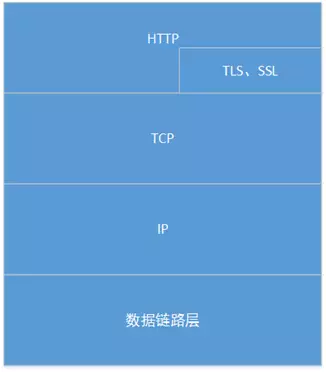

## 技术基石及概述

问：什么是HTTP?		
答：HTTP是一个客户端和服务器端**请求**和**响应**的**标准TCP**。其实建立在TCP之上的。

当我们打开百度网页时，是这样的：https://www.baidu.com

多了个S，其实S表示TLS、SSL。在这里不做解释，因此HTTP的技术基石如图所示：

那HTTP协议呢？HTTP协议（HyperText Transfer Protocol）,即超文本传输协议是用于服务器传输到客户端浏览器的传输协议。Web上，服务器和客户端利用HTTP协议进行通信会话。有OOP思想的得出结论：其会话的结构是一个简单的请求/响应序列，即浏览器发出请求和服务器做出响应。

## 深入理解技术基石和工作流程

既然HTTP是基于传输层的TCP协议，而TCP协议是**面向连接**的**端到端**的协议。因此，使用HTTP协议传输前，首先建立TCP连接，就是因此在谈的TCP链接过程的“三次握手”。如图

在Web上，HTTP协议使用TCP协议而不是UDP协议的原因在于一个网页必须传送很多数据，而且保证其完整性。TCP协议提供传输控制，按顺序组织数据和错误纠正的一系列功能。

一次HTTP操作称为一个事务，其工作过程可分为四步：

> 1、客户端与服务器需要建立连接。（比如某个超级链接，HTTP就开始了。）
>
> 2、建立连接后，发送请求。
>
> 3、服务器接到请求后，响应其响应信息。
>
> 4、客户端接收服务器所返回的信息通过浏览器显示在用户的显示屏上，然后客户机与服务器断开连接。

建立连接，其实建立在TCP连接基础之上。图解核心工作过程（即省去连接过程）如下：

## 详解工作过程的HTTP报文

HTTP报文由从客户机到服务器的请求和从服务器到客户机的响应构成。

### 请求报文格式如下

> 请求行
>
> 通用信息头
>
> 请求头
>
> 实体头
>
> **（空行）**
>
> 报文主体

如图，请求我博客一篇文章时发送的报文内容：

对于其中请求报文详解:

> 1、请求行
>
> 方法字段 + URL + Http协议版本
>
> 2、通用信息头
>
> Cache-Control头域：指定请求和响应遵循的缓存机制。
>
> keep-alive 是其连接持续有效【在下面百度的例子，会得到验证】
>
> 3、请求头
>
> Host头域，脑补吧
>
> Referer头域：允许客户端指定请求URL的资源地址。
>
> User-Agent头域：请求用户信息。【可以看出一些客户端浏览器的内核信息】
>
> 4、报文主体
>
> 如图中的 “ p=278 ”一般来说，请求主体少不了请求参数。

### 应答报文格式如下

> 状态行
>
> 通用信息头
>
> 响应头
>
> 实体头
>
> **（空行）**
>
> 报文主体

如图，就是这篇博客响应的内容:

对其中响应报文详解：

> 1、状态行
>
> HTTP协议版本 + 状态码 + 状态代码的文本描述
>
> 【比如这里，200 代表请求成功】
>
> 2、通用信息头
>
> keep-alive 是其连接持续有效【在下面百度的例子，会得到验证】
>
> Date头域：时间描述
>
> 3、响应头
>
> Server头：处理请求的原始服务器的软件信息。
>
> 4、实体头
>
> Content-Type头：便是接收方实体的介质类型。（这也表示了你的报文主体是什么。）
>
> **（空行）**
>
> 5、报文主体
>
> 这里就是HTML响应页面了，在截图tab页中的response中可查看。

一次简单的请求/响应就完成了。

## HTTP协议知识补充

请求报文相关：

请求行-请求方法

| 请求方式    | 说明                             |
| :------ | :----------------------------- |
| GET     | 请求获取Request-URI所标识的资源          |
| POST    | 在Request-URI所标识的资源后附加新的数据      |
| HEAD    | 请求获取由Request-URI所标识的资源的响应消息报头  |
| PUT     | 请求服务器存储一个资源，并用Request-URI作为其标识 |
| DELETE  | 请求服务器删除Request-URI所标识的资源       |
| TRACE   | 请求服务器回送收到的请求信息，主要用于测试或诊断       |
| CONNECT | 保留将来使用                         |
| OPTIONS | 请求查询服务器的性能，或者查询与资源相关的选项和需求     |

响应报文相关：

响应行-状态码

| 状态码  | 说明                   |
| :--- | :------------------- |
| 1xx  | 指示信息–表示请求已接收，继续处理    |
| 2xx  | 成功–表示请求已被成功接收、理解、接受  |
| 3xx  | 重定向–要完成请求必须进行更进一步的操作 |
| 4xx  | 客户端错误–请求有语法错误或请求无法实现 |
| 5xx  | 服务器端错误–服务器未能实现合法的请求  |

常见的状态码

> 200 OK
>
> 请求成功（其后是对GET和POST请求的应答文档。）
>
> 304 Not Modified
>
> 未按预期修改文档。客户端有缓冲的文档并发出了一个条件性的请求（一般是提供If-Modified-Since头表示客户只想比指定日期更新的文档）。服务器告诉客户，原来缓冲的文档还可以继续使用。
>
> 404 Not Found
>
> 服务器无法找到被请求的页面。
>
> 500 Internal Server Error
>
> 请求未完成。服务器遇到不可预知的情况。

比如304，在浏览器第一次打开百度时，如图所示:

刷新一下：

这上面的304就证明了

> 1、304状态码:有些图片和js文件在本地客户端缓存，再次请求后，缓存的文件可以使用。
>
> 2、以上所以HTTP请求，只靠一个TCP连接，这就是所谓的**持久连接**。

## 关于HTTP协议的Web应用框架或者规范

JavaEE的人会知道Servlet规范。其中Web应用容器都实现了HTTP协议中的对象，即请求和响应对象。比如 javax.servlet.http.HttpServletResponse 对象中肯定有对状态码描述，如图

至于如何使用它们，坐等系列文章吧。

## 总结

回顾全文，HTTP协议其实就是我们对话一样，语言就是其中的协议。所以掌握HTTP协议明白以下几点就好：

> 1、用什么通过HTTP协议通信
>
> 2、怎么通过HTTP协议通信
